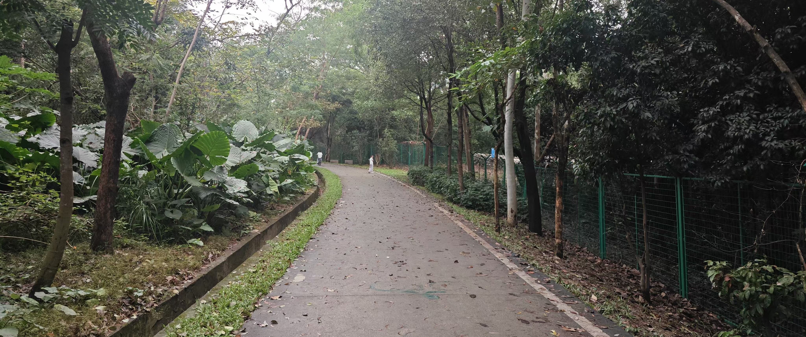
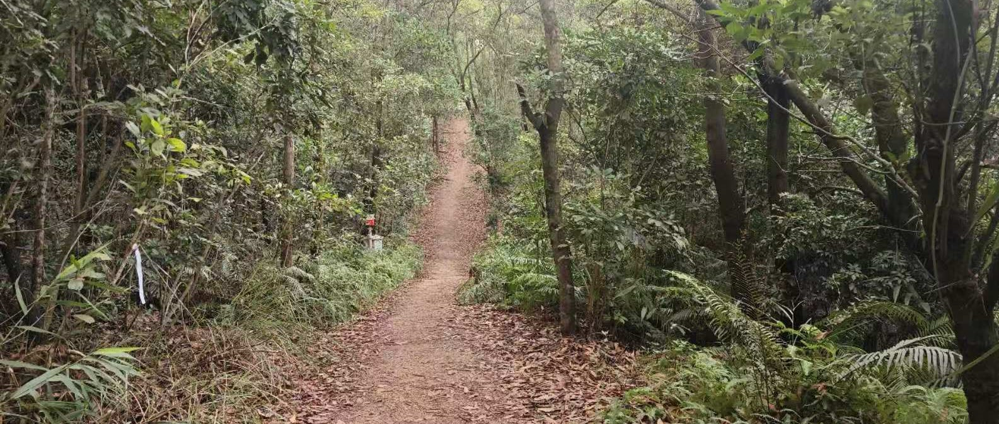
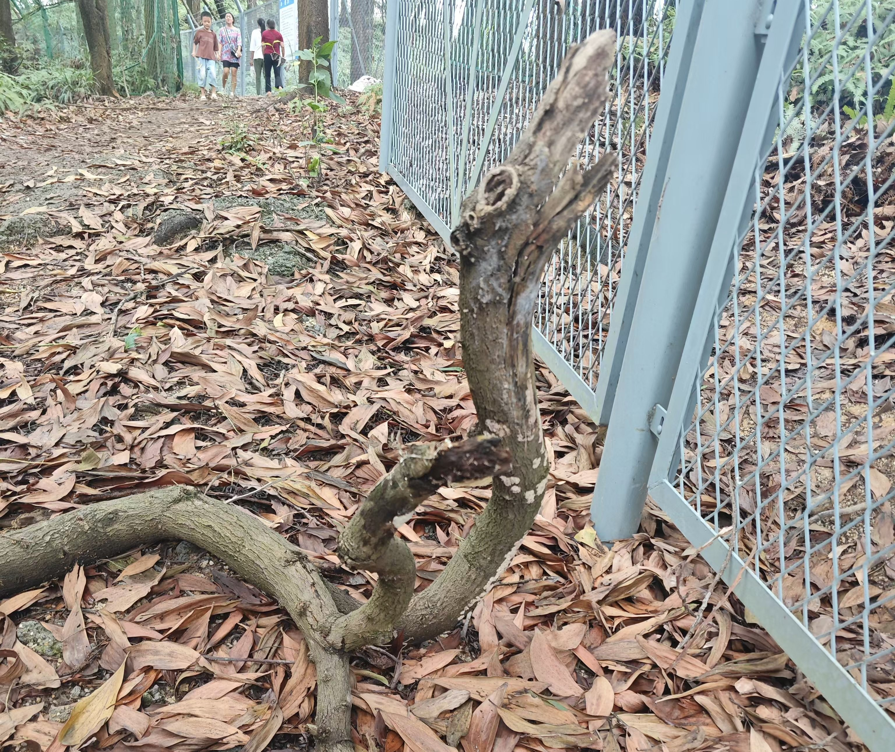
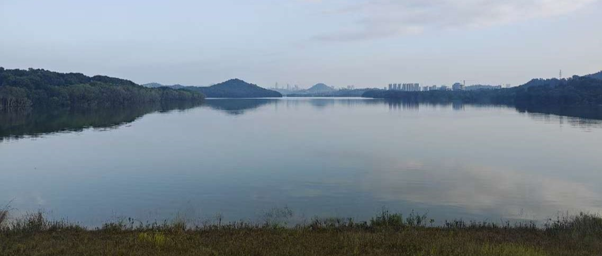
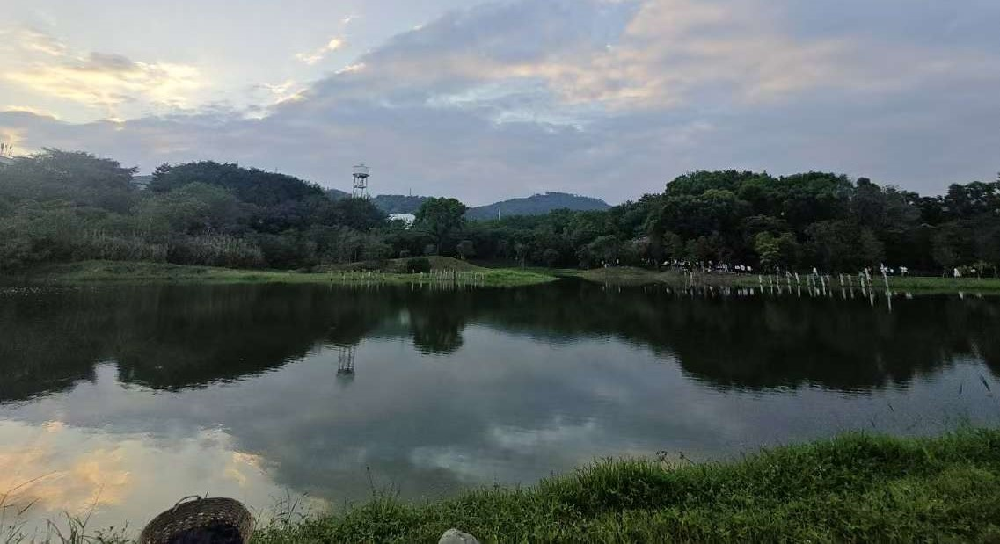
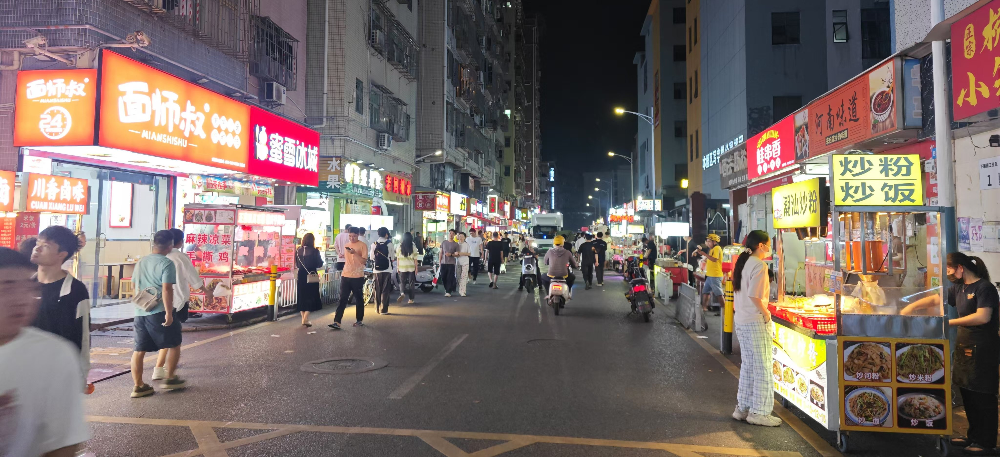
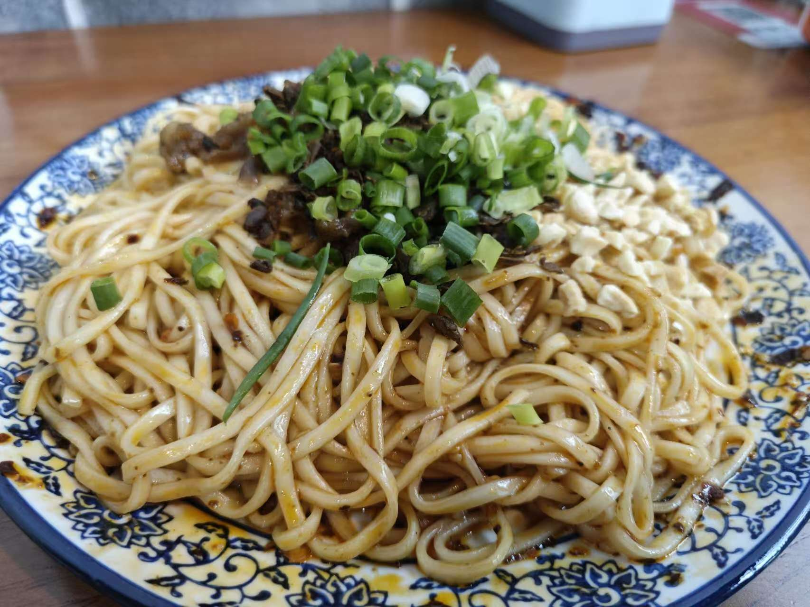
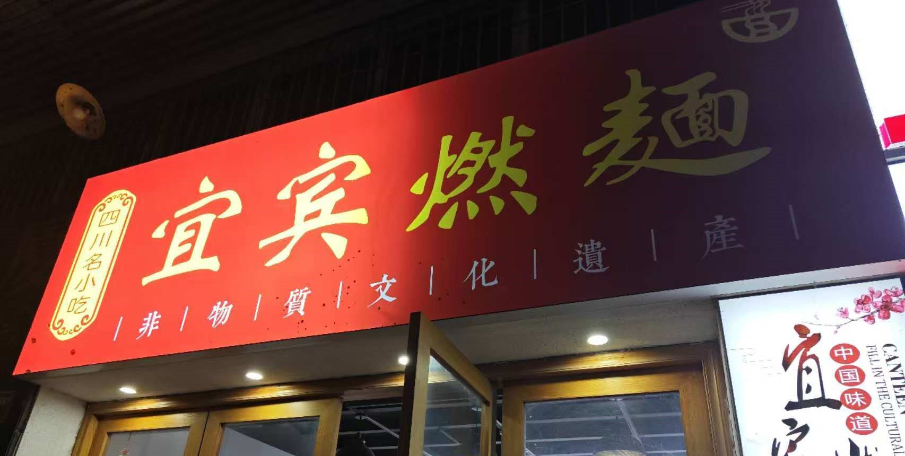
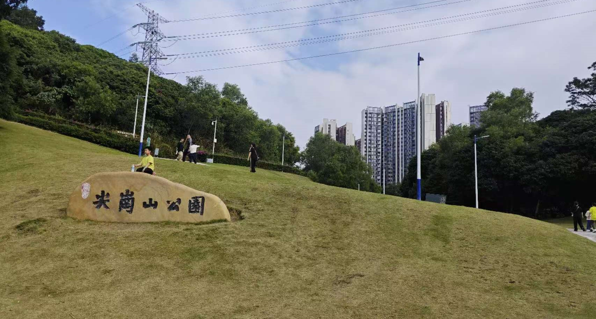
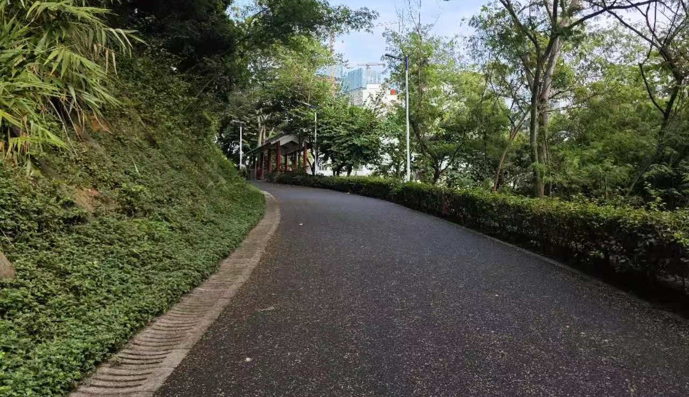

# 宝安

## 鲲鹏径第二段

包括：九围湿地公园、铁岗水库。强烈建议两者花半天一同游玩。

### 铁岗水库

由于是一级饮用水保护区，无法亲临湖边。水库边都有围栏和植物遮蔽，仅一处可以望远。这也是建议与湿地公园一同游览的原因，在此缺失的风景可在湿地公园弥补。

尽管如此，此地十分适合散步和骑行。水库路段大约2km，全程沥青路，弯道处提示完备，绿树荫蔽下骑车或散步十分惬意。人少，安宁、静谧。导航“桃花源智创小镇”，从红色塑胶地处进入到铁门位置。可以将自行车搬入，保安不会阻拦。

两侧的风景实在不算很好，但人少安静的环境足以弥补这点。

### 九围湿地公园

2024年11月新开的公园。

公园的面积很大，景色优美，设施完备。非常适合游览。从铁岗水库西侧出铁门，按照门口标牌指示通过郊野径（土路）走大约1km可到达九围湿地公园。并附铁岗水库眺望图。

约1km的郊野径并不陡峭，比较好走，每个岔路都有指示牌标记方向。

///caption
到湿地公园的土路
///

///caption
路上所见：蛇的枯枝
///

///caption
铁岗水库眺望
///

公园内有亲水码头、汀步桥、草坪、栈道等多种休闲设施，有环湖跑道和步行道供行人锻炼。园内生态环境良好，鸟鸣随处可闻，游鱼岸边可见，野鸭、白鹭在湖面上觅食。湿地公园与远方的凤凰山一起，构成了一幅颇具立体感的画面。

///caption
九围湿地公园
///

!!! warning
    环湖一周距离较长，且中途无出口。请量力而行。

## 固戍

地铁站F口附近有夜市，也有一些生意很不错的餐馆。在附近游玩的话可以在此解决晚餐。

///caption
固戍夜市
///

在“味湘红”餐馆旁有卖豆腐干的流动小贩。亲测味道不错。

另外，看到生意不错但未亲自品尝的有：

- 老舅烧烤
- 三顾冒菜
- 味湘红
- 新屋烧烤
  
着重推荐地铁口附近一家正宗的宜宾燃面馆子。招牌和店面都很简朴，但味道棒。

{:style="width:400px""}
///caption
宜宾燃面
///
{:style="width:400px""}
///caption
店面招牌
///

川渝同学不要错过。

## 临海

### 壹方城购物中心

5号线/1号线 **宝安中心站F口** 直达。

十分高大上的购物中心。餐饮服饰等一应俱全。缺点是消费比较高。前往欢乐港湾时可以顺路在此解决吃饭问题。

### 欢乐港湾

5号线 **临海站B口** 直达。餐饮店也比较丰富。欢乐港湾有海滨可散步，吹吹海风，眺望远方的广深沿江高速也十分惬意。

欢乐港湾与大铲湾另一面的前海演艺公园/前海石公园遥相呼应。在另一侧可以看这侧的摩天轮夜景。

新开通了桥底绿道可在高架桥下步行/骑行，远眺伶仃洋。

!!! warning
    截止2024-11-14，欢乐港湾滨海部分在改造升级，但摩天轮可正常乘坐。

## 红树林生态公园

位于宝安机场南的生态公园，如游览桥底绿道可顺路前往。

## 前海石公园/前海演艺公园

前海附近是深港合作区，据称代表深圳的未来。公园可看日落。

## 尖岗山公园

公园不大，可顺路前往。包括草坪和山。大约30min内可登顶。有台阶和柏油路两种登山选择。是散步的好去处。

