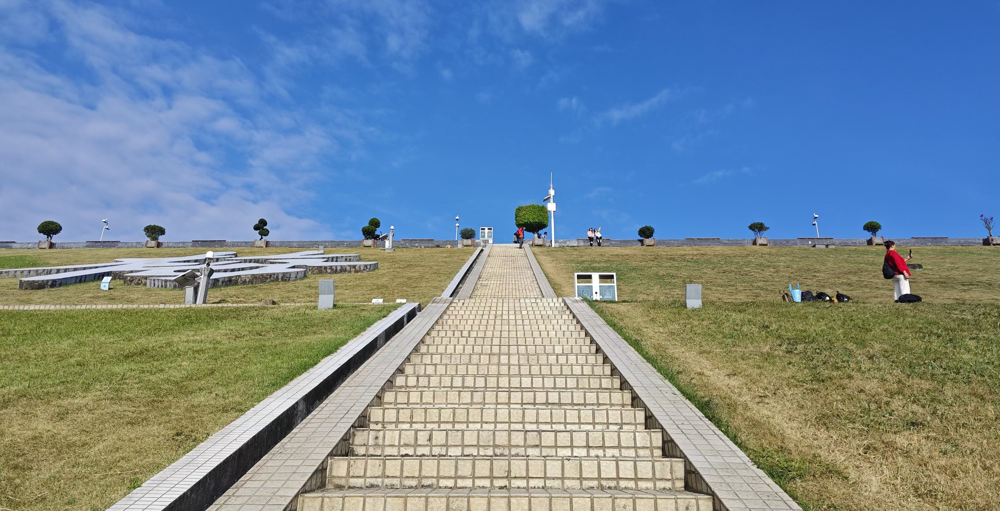

# 福田

## 莲花山公园

深圳不错的公园之一。有山有湖，可放风筝。登顶莲花山可看市民中心夜景。附近梅林有不少美食。直达深业上城。顺便可以在深交所金融街区看看。对川渝的同学推荐梅林的“龍小面”，味道很正宗。

!!!warning
    辣度和味道同样正宗。能吃辣的同学不要习惯性点重辣。

///caption
福田市民中心夜景
///

莲花山公园可以直达附近的深业上城、笔架山公园。

## 笔架山公园/福田河绿道

这俩是福田区“五园联通”项目的一部分，可以放在一起游览。另外离会展中心距离也比较近，看完展如果有时间可以来散散步。

2024年国庆节期间在笔架山公园开展了七天无人机演出。

## 市民中心

深圳标志性的CBD。周末晚上有灯光秀，可以顺带来看看深圳博物馆的特展。附近的商场有福田星河COCO PARK、皇庭广场。这里吃喝不愁。

## 梅林山

山下就是梅林水库。几步台阶到达水库边，天气晴朗的时候来吹吹风很不错。

梅林山同样有郊野径。比较陡峭，请一定注意安全。上到大脑壳可以俯瞰城市。下山之后可以去“卓悦汇”或梅林用餐。