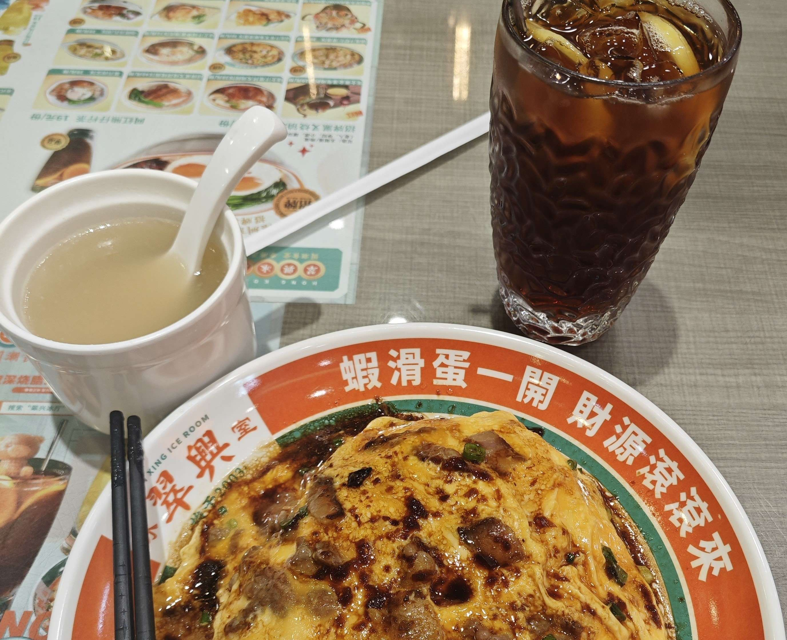

# 欢迎访问ShenzhenTrips

ShenZhenTrip收集广东省深圳市及周边旅游攻略。提到的所有地点，除特别标注外均亲自前往过。

让我们从大学城周边开始。

某个无课的下午、心烦意乱的傍晚、临时起意的出游，这些就在学校附近的地方再好不过。游览结束后还能剩下晚上的时间自由安排。

## 大沙河——深圳湾

大沙河绿道适合骑行。沿河南/东岸（大学城哈工大侧）可抵达深圳湾公园/人才公园。到达海边左转向东，约20min后可至深圳湾公园地铁站，站内A/D口“站前町”商业街可顺便解决晚餐。

地铁：9号线深圳湾公园 -> 车公庙 -> 7号线西丽湖回大学城北门，另可选择西丽湖站换乘5号线至大学城地铁站。

!!! warning
    大沙河绿道节假日不允许骑行。
    木栈道段不允许骑行。

2024-11-22 大沙河绿道施工路段如下：

- **东岸**：一小段，上桥可绕过
- **西岸**：九祥岭湿地公园部分全程不可通过，但是目测已全部修建完毕；万象天地附近一段不能进入。无法从西岸到达深圳湾。

## 环西丽湖碧道

精华段位于西丽湖东侧，从西丽湖牌坊处进入绿道。全程约3km，适合周中晚饭后小小散步。缺点是不适合骑行（有小段台阶）且不是环线，必须原路返回，沿途无餐饮。另外此地不允许放风筝。

!!! danger
    不建议走太远，北方是大磡村。沿途部分路段晚上没有路灯。估算好返程时间。

## 西丽366大街

晚餐不想在食堂草草了事？那么一站地铁直达西丽F口366大街便是好去处。

美食推荐：

- 窄巷口生烫牛肉米线：肉酱米线味道不错，且有四川人爱吃的豌豆尖（有时专为豌豆尖前来）。另外366街上有家生滚吊龙米线也不错。
- 云边小食堂：目前在深圳吃到最正宗的过桥米线。但避雷这家的小吃，都是预制菜。
- 鸿禧面包：开在366大街里一家不起眼的小铺子。面包价格便宜，适合当日在西丽解决晚餐后带回两三个，做夜宵/早点。另外街上也有几家面包房，有的有买二送一活动，也很划算。
- 土家酱香饼：4 - 5元一份的酱香饼，在地铁F口附近。价格便宜味道不错，5元可以买一份。垫垫肚子的选择。 
- 黄记正轩牛奶专家：双皮奶/姜撞奶不错，据说是正宗的老广味道。

另外也可以不去366大街，在学校周边或假日里解决晚餐，平山村里的“翠兴冰厅”味道不错。

{: style="height:300px"}
///caption
翠兴冰厅 牛叉滑蛋饭 + 冻柠茶
///
{: style="height:300px"}
/// caption
窄巷口生烫牛肉米线 + 烫豌豆尖
///

366大街打过牙祭之后，可以选择往九祥岭湿地公园方向，从桥上进入大沙河绿道回学校。注意如果骑行，选择**东侧**步道，西侧步道目前不通，且只有汀步桥过河，不能过自行车。

如果天色较晚，九祥岭湿地公园有灯光木栈道，可顺便路过，感受此地的别样意境。

!!! warning
    注意：从大沙河回学校比从城市道路走更远，若赶时间请勿选择。

若是下午出发的较早，可以在旁边的**石鼓山公园**走走。在这小山上爬几级台阶有助于消耗能量提升胃口。公路的路径设计成环状的，游览体验不错。

## 万科云城

较远，但附近的**西丽生态公园**可以顺路游览一番，体验公园里的玻璃平台。同时云城高楼的夜景也不错。可顺路解决晚餐。推荐ITARU食堂，可以坐在外面桌子上看着灯光用餐。环境加分，但味道一般。

{: style="width:400px", loading=lazy}
///caption
西丽万科云城
///

## 宝能环球汇

学校周边最大的商场。公交/地铁塘朗站/骑行均可方便到达。

此处餐饮多是连锁品牌。吃过觉得不错的有：

- 渝月：比较正宗的川菜馆
- 南里奥巴西烤肉：自助烤肉，店员烤好送到桌子上，比较方便。缺点是小贵。
- 喜家德水饺：连锁饺子馆，有时会出新品。

另外比较有名的有：克茗冰室、麺屋猪一、三界山川派寿司、肥韬冰室、金戈戈香港豉油鸡（在商场外）等。其余的可自主参考大众点评等。此地的优点是地方大餐饮品类多，适合想打牙祭但一时不知道吃什么的时候前往。交通便利。

!!! note
    别薅着益田假日里不放，适时地选择新地点吃饭也不错。

## 大学城体育馆

从校内到体育馆实际上比从校外走距离更远。从大学城门出门左转，在体育馆门进入，即可到达游泳馆。

羽毛球/游泳等均可作为晚上放松的不错选择。游泳馆可顺便洗热水澡，比宿舍条件好一些。每天下午上完课，适当运动后再继续学习也是提高效率的好方式。

## 深圳大学/南方科技大学

两个学校的夜景都不错，沿大沙河绿道往东走即可到达。

{loading=lazy}
/// caption
深圳大学湖边鸭子
///

湖边的鸭子不怎么怕人，不知道能不能上手摸。

{loading=lazy}
///caption
深大夜景
///

深大校门外有夜宵摊，比起大学城南门/西南门的要规范不少。

## 兴东

地铁站F口有不错的川菜馆“巷里·四川豆花”。豆花不错但蘸水不够好，炒两个小菜也是不错的。

顺便可以游览附近的尖岗山公园。有公路和台阶可以上山，也有大块草坪可供休憩。但不建议专程前来。附近的西乡河绿道等骑行体验都不错。可以下午来骑骑车。

!!! warning
    附近路段晚上光线不好。

## 支持作者

🌟让旅行更美好，感谢您的支持🌟

{: style="width:200px"}