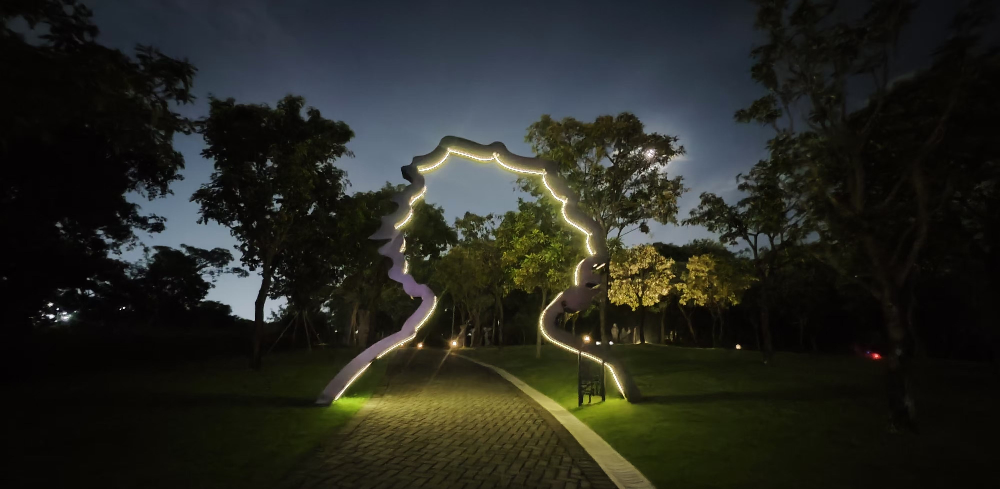

# 南山

## 深圳湾公园

公园面积很大，是深圳的地标公园之一。可骑行可散步。跨南山、福田，候鸟季节有许多海鸟在此停留。适合看日出、观察生态等。

**观鸟时间**：每日15:00 - 17:00，落潮时更佳。**候鸟季**大约是每年12月至次年2月。

!!! warning
    请勿投喂野生鸟类。

## 南头古城/中山公园

南头古城是深圳少有的古城，但基本上和其他各地的古镇无太大区别。顺路可以逛逛旁边的中山公园。

## 南山

没爬过，有点遗憾。有大南山、小南山。

## 人才公园

晚上好去处。推荐周五晚上骑行至大沙河入海处，右转到人才公园看夜景。晚餐可至附近的**万象城**或**海岸城**（地铁：后海站）解决。期望看到这篇文章的你的姓名有一天也能出现在人才公园的光柱上。每年11月1日是深圳人才日，人才公园会举办嘉年华。

地铁13号线开通后，可以在留仙洞站换乘13号线，到达人才公园。（2024-11-22）受西丽交通枢纽施工影响，13号线北段无法如期开通，2024年底只能开通南段。

白天的人才公园风景也是不错的。在海边随朝阳一起，看这座现代化的都市苏醒。

///caption
清晨的人才公园
///

///caption
人才公园夜景
///

///caption
人才公园一角
///
## 蛇口/海上世界/游轮

蛇口邮轮母港开设了港珠澳大桥游览航线，全程大约3小时，船上有魔术表演、甲板音乐会等节目，工作日票价大概在300元左右。不建议在船上吃饭，可到附近的海上世界解决，顺便海滨漫步。

///caption
海上世界望海
///

!!! note "深圳填海"
    “海上世界”得名并不像看起来那么夸张。以前明华轮是在海水里的。如果留心，可以看到海上明华轮靠陆地一侧有一条深圳旧海岸线标记。深圳填海后海岸线整体外移。可以看看深圳填海前后对比图，远比我想象中的面积大得多。

    “蛇口模式”炸山填海是深圳在改革开放初期的模式。了解更多：[特稿 | 深圳填海三十年（上）](https://www.thepaper.cn/newsDetail_forward_2473058)。

    由于生态保护、填海成陆后空置严重等原因。目前已几乎没有填海项目。

///caption
游轮从港珠澳大桥下穿过
///

附近 **赤湾山（文天祥纪念公园）** 可以顺带游览，小山包登顶约30min，可以俯瞰蛇口港。今年的“深圳舰 深圳见”没抢到票的可以到山顶看军舰。另外可去赤湾左炮台看看，据称关天培在此处大败伶仃洋英军。

蛇口港是珠江口东岸的重要深水港和物流枢纽，毗邻香港，地理位置优越。港口以集装箱运输为主，同时提供散货和客运服务，包括蛇口邮轮中心的多条国际航线，连接港澳及东南亚。作为粤港澳大湾区的重要交通门户，蛇口港不仅推动区域经济发展，还为国际贸易提供高效便捷的通道，是深圳现代化港口体系的重要组成部分。

///caption
俯瞰蛇口港
///

!!! warning
    蛇口港附近火车多，注意安全。

## 蛇口老街

是老深圳的记忆之一。老街上有许多美食，但部分店铺是徒有其名。至少“蛇口康乐鱼仔档”令我大失所望。但附近城中村里隐蔽的竹升面不错，街上的牛杂和小刘炸豆腐也值得一尝。

{:style="width:400px", loading=lazy}
///caption
牛杂，忘记店名了
///

{:style="width:400px", loading=lazy}
///caption
小刘炸豆腐，配上泡菜特别好吃
///

## 大沙河绿道

平时散步颇有意思。夜游大沙河值得尝试。亲测路不熟+怕黑+体力差情况下三小时可以到达海边，熟练之后两小时可达海边。凌晨出发独自前往海边值得每一个人尝试！

夜晚河畔随机刷新夜钓者、夜骑者。请注意安全。

!!! danger
    大沙河晚上23:00后无照明。夜游记得带上手电筒和充电宝。
    
    另外小心灌木中窜出的野猫、老鼠以及可能出现的蛇。大学城段照明尚可，后面部分没有任何灯光、也没有人。

## 塘朗山

山上有猴子。体力不错的可以尝试银湖山-梅林山-塘朗山（银梅塘）穿越。

{loading=lazy}

塘朗山一样可以选择公路和郊野径。建议下山走公路，石头铺就的郊野径有些陡峭。