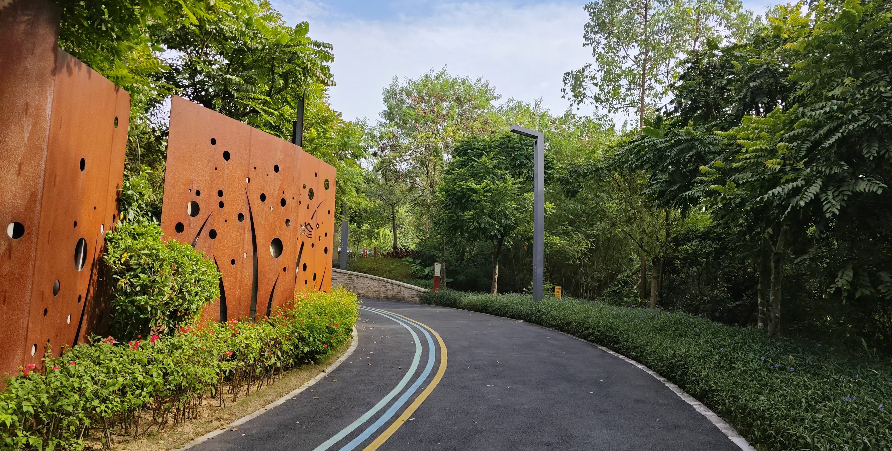
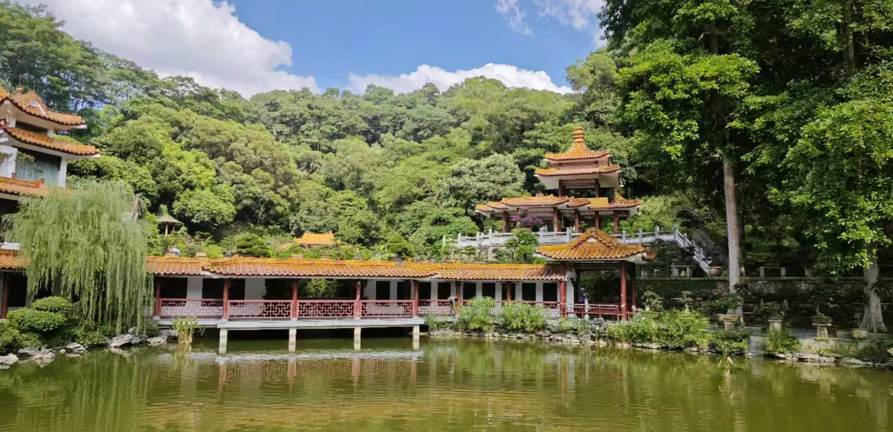
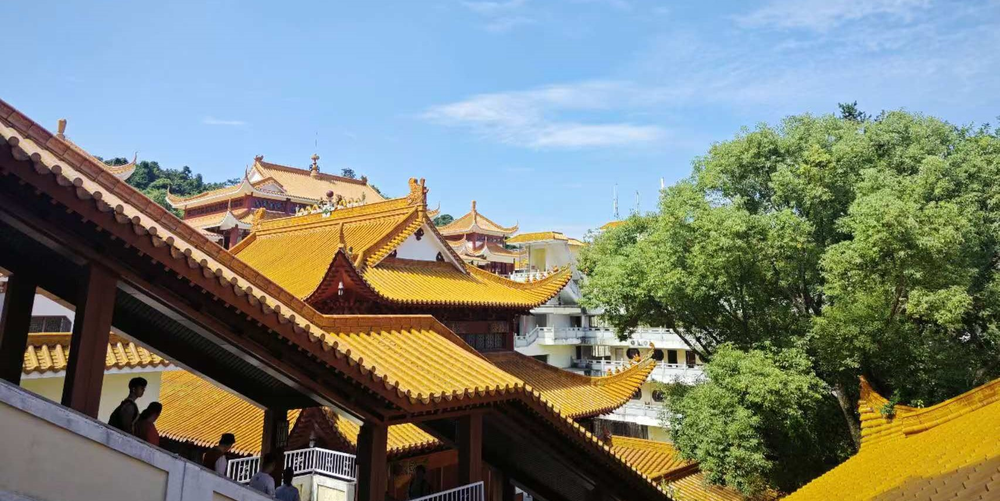

# 其他

## 光明

### 虹桥公园/大顶岭绿道

适合阴天前往，由于虹桥上没有遮挡，不建议在烈日下强行通关。在别具风味的红色桥上行走颇有意思。附近光明大街处可以品尝光明乳鸽（刘冰乳鸽店/光明招待所）

## 龙岗

### 银湖山郊野公园

银湖山很大，而且山上有烂尾楼可供探险。爬升较大，部分坡道很陡。好在可以全程公路上山下山。少有的可以骑行的山路。

!!!danger
    此处骑行颇有挑战。有部分急弯、坡也很陡。

    银湖山郊野径坡度较大而且人少，比较“野”，不建议单人前往。

### 雪竹径公园

一个运动公园，全程大约8km。几乎都是平路，没有爬升，人也较少。有大块草坪适合露营野餐。

///caption
雪竹径公园
///
!!! warning
    公园以前有骑行道，但目前不允许骑行。

## 罗湖

### 仙湖植物园

深圳“开放世界探索式”景点。在植物园里可以进入不同园区感受。园内的弘法寺提供斋饭。门票10元，需要在微信公众号上预约。早上8:00前到达可以免门票进入。

///caption
仙湖植物园
///

/// caption
弘法寺
///