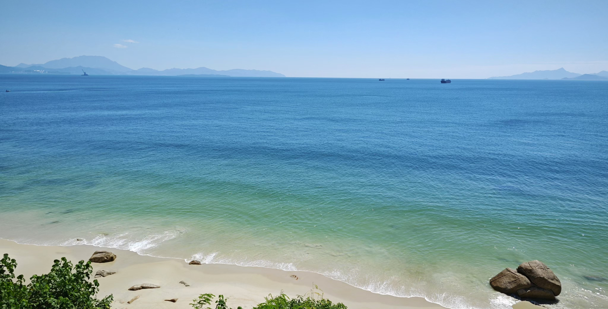

# 盐田 

## 沙头角/中英街

## 大梅沙/小梅沙/盐田海滨栈道

深圳地铁直达的沙滩。目前（2024-11-14）小梅沙未完全建设完毕，但海洋世界已开放。

大梅沙小梅沙下午人比较多。但是倘若早点出发，早上10点以前基本上没有什么人，可以自由游览。大梅沙沙滩提供付费的淋浴、储物柜。有免费冲脚池而且数量够多。是不消费也能玩的很开心的公园之一。

出行建议：地铁2/8号线盐田墟站下，从海滨栈道走到大梅沙，或直接坐地铁到大梅沙站沙滩漫步。

缺点是周边没有什么餐饮，个人习惯的是在海鲜街附近的德米肠粉解决用餐，点最便宜的肠粉+油条。其他肠粉不是很建议，价格偏贵且料放的较少。这家的蒜蓉辣椒酱味道不错，不能吃辣的请慎放。

## 盐田高级中学观景台

导航“盐田高级中学”上坡后就是观景台了。可以俯瞰盐田港夜景。下山可以选择走登山栈道，到达公交“海港大厦”站乘坐公交到5号线怡景站换乘地铁直达学校。大约5min就可以下到山下，但全程无路灯，不建议晚上独走。

## 马峦山(盐田-坪山)